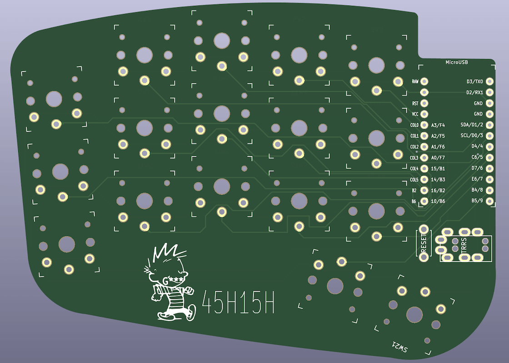

# Haigha Mod

This is a modification of [Haigha][1] keyboard.

It is a 34 keys, split keyboard designed for Choc switches.

The PCB is reversed for right side.

Completed keyboards with Chicago Stenographer and  MBK Choc
keycaps.

[1]: https://github.com/davidphilipbarr/36keys/tree/master/34Keys/Haigha
